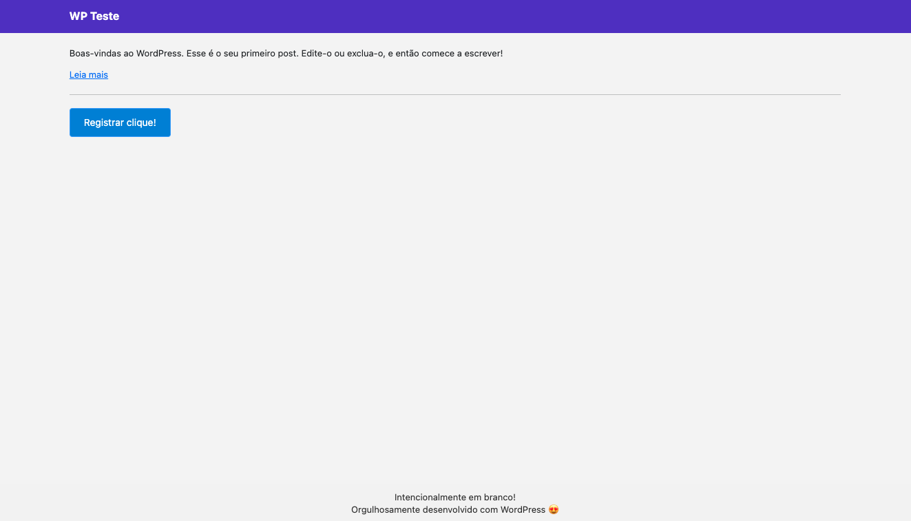

# Plugin - BTN Count

## Clube do Valor | Teste Desenvolvedor Wordpress

**Contribuidores:** Elias Faiçal  
**Versão Atual:** 1.0  
**Testado até:** 6.4.2
**Requer o WordPress:** 6.0 ou superior  
**Licença:** GPL-2.0+
**URI da Licença:** http://www.gnu.org/licenses/gpl-2.0.html

## Descrição e uso

Este plugin adiciona o shortcode `[btn_shortcode]` ao site. Esse shortcode mostra um botão na página que, quando clicado, adiciona um registro de data e hora no banco de dados. Ao ativar o plugin a função `criar_tabela_cliques` é chamada e a tabela `wp_cliques` é criada automáticamente, nesta tabela será registrado uma listagem das entradas.

## Capturas de Tela

